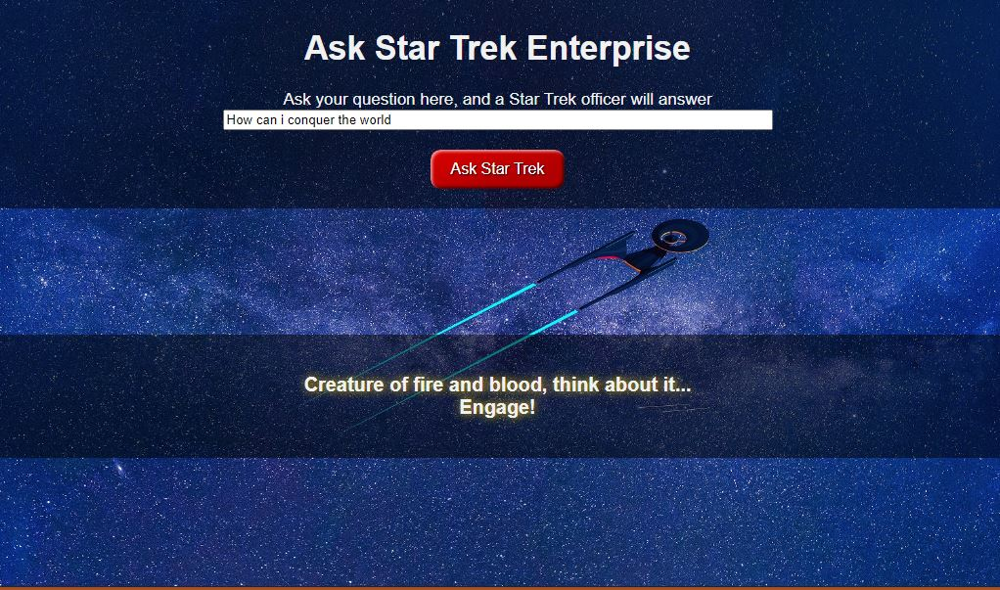

# Mixed Messages Group Projects in The Full-Stack Engineer Path

### Update : Culdn't find available people within my timeframe so I did it on my own . 

### 1. Understand the Project
  + My project has put together a list of famous lines from Star Trek Enterprise .
  +  You ask your question, and beyond space and time a wise answer will be sent back to you. 
  + 

### 2. Find Your Teammates
  **Sources:**
  + [CodeCademy group](https://discuss.codecademy.com/t/full-stack-engineer-group-106-2022/640049)
  + [CodeCademy discord](https://discord.com/invite/g5vzQCstyB) 
  + [CodeCademy Facebook group](https://www.facebook.com/groups/codecademy.community/)
  + [CodeCademy Chapter](https://community.codecademy.com/)
  
 ### 3. Build Your Team
  + Team leader who codes 
  + UX/UI Developer
  + front end developer
  + back end developer 

### 4. Learn How Teams Work
  + Understanding the concepts [here](https://discuss.codecademy.com/t/guide-how-developer-teams-work/394900)

### 5. Get to Work
  + commnication via forum 

### 6. Step Six – Share!
  + Because sharing is caring! 

